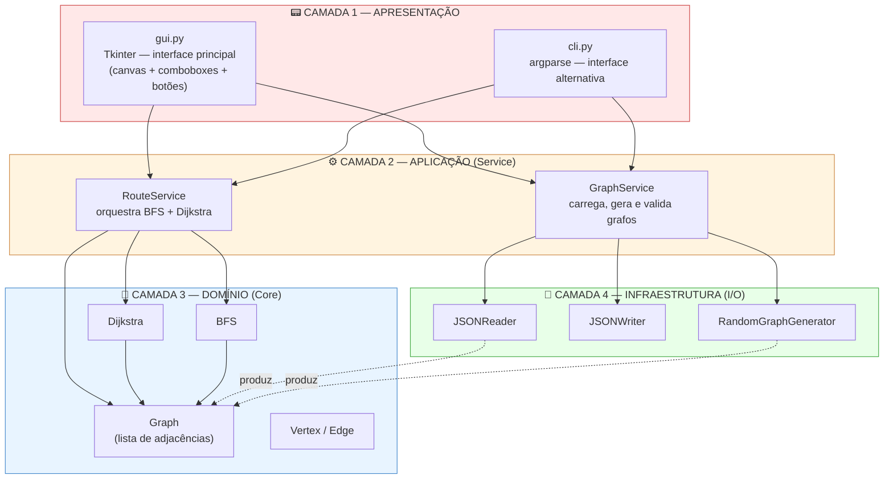

# E2 — Design Técnico, Arquitetura e Backlog

> **Disciplina:** Teoria dos Grafos
> **Prazo:** 13 de abril de 2026
> **Peso:** 20% da nota final

---

## Identificação do Grupo

| Campo | Preenchimento |
|-------|---------------|
| Nome do projeto | **FoodNode Analytics** — Sistema de Roteamento Ótimo para Entregas de Fast-Food |
| Repositório GitHub | https://github.com/LuishPalacio/foodnode-analytics |
| Integrante 1 | Luís Henrique Palacio — RGM 37620932 |
| Integrante 2 | Eduardo Pereira — RGM 38270102 |
| Integrante 3 | Gabriel Henrique Alves — RGM 38561310 |

> **Nota de revisão (07/05/2026):** Esta versão do E2 incorpora um ajuste na camada de Apresentação solicitado pela professora durante a fase de implementação do E3: a interface principal passou de CLI (linha de comando) para **GUI desktop com Tkinter**. A CLI foi mantida como interface alternativa para automação e scripts. As demais decisões técnicas (algoritmos, arquitetura em 4 camadas, dataset, backlog) permanecem inalteradas.

---

## 1. Algoritmos Escolhidos

### 1.1 Algoritmo Principal

| Campo | Resposta |
|-------|----------|
| Nome do algoritmo | Algoritmo de Dijkstra |
| Categoria | Guloso (greedy) — com relaxamento de arestas via fila de prioridade |
| Complexidade de tempo | O((V + E) log V) — implementação com min-heap binário |
| Complexidade de espaço | O(V + E) — lista de adjacências + vetores de distância e predecessor |
| Problema que resolve | *Single-source shortest path* (caminho mínimo a partir de uma origem) em grafo dirigido ponderado com pesos não-negativos |

**Por que este algoritmo foi escolhido?**

A escolha do Dijkstra decorre diretamente da modelagem definida no E1: a malha viária do bairro atendido pelo restaurante é um grafo **dirigido** (mão única, conversões proibidas) e **ponderado** com pesos **estritamente não-negativos** (a distância em metros entre dois cruzamentos é sempre ≥ 0). Esta combinação corresponde exatamente ao domínio de aplicabilidade do Dijkstra, que é matematicamente ótimo nessa classe de grafos.

Três fatores reforçam a escolha no contexto específico do sistema:

1. **Compatibilidade com a natureza esparsa da malha viária.** Em grafos urbanos típicos, E ≈ 2V a 4V (cada cruzamento conecta em média a 2–4 outros). Com lista de adjacências e min-heap binário, o Dijkstra executa em O((V+E) log V), o que mantém o sistema responsivo mesmo para grafos de centenas de cruzamentos — requisito declarado no E1.
2. **Determinismo e previsibilidade.** A garantia de otimalidade é fundamental para o domínio: uma rota "quase ótima" entregue com 2 minutos de atraso representa prejuízo real de negócio. Algoritmos gulosos puros (sem relaxamento) não garantem o caminho mínimo global.
3. **Simplicidade de implementação e manutenção.** O Dijkstra pode ser implementado em ~40 linhas de Python com `heapq`, sem dependências externas, o que cabe no prazo da disciplina e permite validação por testes unitários.

**Alternativa descartada e motivo:**

| Algoritmo alternativo | Motivo da exclusão |
|----------------------|-------------------|
| A* (A-star) | A* é teoricamente mais rápido que Dijkstra em domínios geográficos por usar uma heurística admissível (tipicamente distância euclidiana até o destino). No entanto, seu uso pressupõe que cada vértice armazene coordenadas (latitude/longitude) e exige implementação de função heurística adicional, aumentando a superfície de bugs. Para o porte previsto do grafo (até 500 vértices), o ganho de desempenho do A* sobre Dijkstra é marginal (< 50 ms na média), e não compensa o custo de implementação dentro do prazo da disciplina. A* fica registrado como evolução futura se o sistema escalar para grafos metropolitanos (10.000+ vértices). |

Adicionalmente, **Bellman-Ford** foi considerado e descartado porque sua única vantagem sobre Dijkstra é suportar pesos negativos — cenário inexistente no domínio (distância física nunca é negativa). Sua complexidade O(V·E) é estritamente pior.

**Limitações no contexto do problema:**

- **Pesos estáticos.** O Dijkstra assume que os pesos das arestas não mudam durante a execução. O sistema, portanto, não suporta atualização dinâmica de pesos para refletir bloqueios, acidentes ou congestionamento em tempo real — cenário explicitamente colocado em **Out-of-Scope** (seção 5.2). Em uma eventual evolução, o algoritmo indicado seria o **D\* Lite** (KOENIG; LIKHACHEV, 2005).
- **Origem única por execução.** Cada chamada calcula o caminho mínimo a partir de um único vértice de origem.

**Referência bibliográfica:**

> CORMEN, T. H.; LEISERSON, C. E.; RIVEST, R. L.; STEIN, C. **Algoritmos: teoria e prática**. Tradução da 3ª edição. Rio de Janeiro: Elsevier, 2012. Capítulo 24, seção 24.3: "Algoritmo de Dijkstra".
>
> DIJKSTRA, E. W. A note on two problems in connexion with graphs. **Numerische Mathematik**, v. 1, n. 1, p. 269–271, 1959.

---

### 1.2 Algoritmo Adicional

| Campo | Resposta |
|-------|----------|
| Nome do algoritmo | BFS — Busca em Largura (*Breadth-First Search*) |
| Categoria | Busca não-informada / travessia de grafo |
| Complexidade de tempo | O(V + E) |
| Complexidade de espaço | O(V) — fila FIFO + vetor de visitados |

**Justificativa:**

O BFS é executado como **etapa de pré-verificação antes do Dijkstra**, com dois objetivos técnicos diretamente ligados ao domínio:

1. **Detectar alcançabilidade do destino.** Malhas viárias reais frequentemente contêm componentes fortemente conectados disjuntos. Sem a verificação, o Dijkstra simplesmente retorna distância infinita, sem explicação clara para o usuário. Com BFS prévio, o sistema responde de forma explícita *"o endereço do cliente não é alcançável a partir do restaurante"*, evitando ambiguidade operacional.
2. **Listar vértices atingíveis para diagnóstico.** O BFS produz gratuitamente o conjunto de vértices alcançáveis a partir da origem.

O custo adicional é desprezível: BFS é linear em V+E, enquanto Dijkstra é O((V+E) log V).

**Referência bibliográfica:**

> CORMEN, T. H.; LEISERSON, C. E.; RIVEST, R. L.; STEIN, C. **Algoritmos: teoria e prática**. Tradução da 3ª edição. Rio de Janeiro: Elsevier, 2012. Capítulo 22, seção 22.2: "Busca em largura".

---

## 2. Arquitetura em Camadas

O sistema adota arquitetura em 4 camadas com dependências unidirecionais (camadas superiores conhecem inferiores; o inverso nunca acontece). A separação é estrita: a camada de Domínio não importa nenhuma biblioteca de I/O nem de UI, e a camada de Apresentação não conhece detalhes das estruturas de grafo.

> **Atualização da camada de Apresentação:** A interface principal é uma **GUI desktop com Tkinter** (biblioteca padrão do Python), com canvas para visualização interativa do grafo. A CLI foi mantida como interface alternativa para automação. Esta mudança preserva 100% das demais camadas (Aplicação, Domínio, Infraestrutura), demonstrando o valor da arquitetura em camadas escolhida no design original.

### Diagrama de arquitetura



### Descrição das camadas

| Camada | Responsabilidade | Artefatos principais |
|--------|------------------|----------------------|
| **Apresentação (GUI + CLI)** | Interface com o usuário. **GUI Tkinter** como interface principal: janela com painel de controle (botões, comboboxes), canvas para visualização do grafo (vértices coloridos por tipo, arestas com pesos, rota destacada em laranja) e área de resultado. **CLI** mantida como alternativa para automação. Nenhuma das duas contém lógica de negócio. | `src/presentation/gui.py`, `src/presentation/cli.py` |
| **Aplicação (Service)** | Orquestra os casos de uso do sistema. `RouteService` coordena a execução (chama BFS para alcançabilidade e, se positivo, aciona Dijkstra). `GraphService` centraliza operações de ciclo de vida do grafo. | `src/application/route_service.py`, `src/application/graph_service.py` |
| **Domínio (Core)** | Contém as estruturas de dados do grafo (lista de adjacências) e os algoritmos puros (Dijkstra, BFS). Código desta camada é **100% livre de I/O e de UI** — não lê arquivos, não imprime, não desenha, não faz logging. Isso garante que os algoritmos sejam testáveis isoladamente e reutilizáveis. | `src/domain/graph.py`, `src/domain/vertex.py`, `src/domain/edge.py`, `src/domain/algorithms/dijkstra.py`, `src/domain/algorithms/bfs.py` |
| **Infraestrutura (I/O)** | Adaptadores para fontes externas: leitura e escrita de arquivos JSON, geração aleatória de grafos. É a única camada autorizada a tocar o sistema de arquivos. | `src/infrastructure/json_reader.py`, `src/infrastructure/json_writer.py`, `src/infrastructure/random_graph_generator.py` |

---

## 3. Estrutura de Diretórios

```
foodnode-analytics/
├── docs/
│   ├── README.md
│   ├── E1_FoodNodeAnalytics_Documento_de_Visao.md
│   ├── E2_FoodNodeAnalytics_Designer_tecnico.md
│   └── E3_FoodNodeAnalytics_MVP.md
│
├── src/
│   ├── presentation/                 
│   │   ├── __init__.py
│   │   ├── gui.py                    
│   │   └── cli.py                 
│   │
│   ├── application/                 
│   │   ├── __init__.py
│   │   ├── route_service.py
│   │   └── graph_service.py
│   │
│   ├── domain/                       
│   │   ├── __init__.py
│   │   ├── graph.py
│   │   ├── vertex.py
│   │   ├── edge.py
│   │   └── algorithms/
│   │       ├── __init__.py
│   │       ├── dijkstra.py
│   │       └── bfs.py
│   │
│   ├── infrastructure/               
│   │   ├── __init__.py
│   │   ├── json_reader.py
│   │   ├── json_writer.py
│   │   └── random_graph_generator.py
│   │
│   └── main.py                      
│
├── tests/                          
├── data/                             
├── assets/                           
├── .gitignore
├── README.md
├── pytest.ini
└── requirements.txt
```

> **Justificativa de desvios:** A estrutura de 4 camadas é mantida (`presentation/application/domain/infrastructure`) para preservar a separação de responsabilidades aprovada na avaliação original. Dentro de `presentation/`, foram adicionados dois arquivos (`gui.py` e `cli.py`) representando duas implementações da camada — sem nenhum impacto nas demais.

---

## 4. Definição do Dataset

**Formato de entrada aceito:** JSON.

JSON foi escolhido por ser legível, suportado nativamente em Python (`json` da stdlib, sem dependências) e expressivo o suficiente para capturar metadados do grafo junto aos dados. CSV foi descartado por não comportar metadados naturalmente. GraphML foi descartado por exigir parser dedicado.

**Exemplo de estrutura do arquivo de entrada:**

```json
{
  "metadata": {
    "name": "Bairro Centro - recorte de 6 quadras",
    "vertices_count": 8,
    "edges_count": 12,
    "directed": true,
    "weighted": true,
    "weight_unit": "meters"
  },
  "vertices": [
    { "id": 0, "label": "Restaurante (origem)",         "type": "origin" },
    { "id": 6, "label": "Cliente João (destino)",       "type": "destination" }
  ],
  "edges": [
    { "origem": 0, "destino": 1, "peso": 120 },
    { "origem": 0, "destino": 3, "peso": 85 }
  ]
}
```

**Invariantes validadas na carga (`GraphService`):**

- Todo `id` de vértice aparece exatamente uma vez em `vertices`.
- Toda aresta referencia `origem` e `destino` existentes em `vertices`.
- Todo `peso` é numérico e ≥ 0.
- Existe no mínimo um vértice com `type: "origin"`.

**Estratégia de geração aleatória:**

| Parâmetro | Descrição | Default |
|-----------|-----------|---------|
| `n_vertices` | Número de vértices (≥ 2) | 50 |
| `density` | Probabilidade de aresta dirigida entre par ordenado | 0.15 |
| `weight_min` / `weight_max` | Faixa para sorteio uniforme dos pesos (m) | 30 / 2000 |
| `seed` | Semente do RNG para reprodutibilidade | aleatória |
| `force_connected` | Garante conectividade fraca via árvore geradora | `false` |

---

## 5. Backlog do Projeto

### 5.1 In-Scope — O que será implementado

| # | Funcionalidade | Prioridade | Critério de aceite |
|---|----------------|------------|--------------------|
| 1 | Carga de grafo a partir de arquivo JSON | Alta | **Dado** um arquivo JSON válido com 50 vértices e 120 arestas, **quando** o usuário acionar a função de carga (via GUI ou CLI), **então** o sistema carrega o grafo em < 500 ms, valida invariantes e exibe estatísticas. |
| 2 | Cálculo do caminho mínimo com Dijkstra | Alta | **Dado** um grafo carregado e um par origem-destino alcançáveis, **quando** o usuário solicitar o cálculo, **então** o sistema retorna a sequência de vértices, o custo total em metros e o tempo de execução em < 1 segundo. |
| 3 | Verificação prévia de alcançabilidade com BFS | Alta | **Dado** um grafo em que o destino está em componente disjunto, **quando** o usuário solicitar a rota, **então** o sistema detecta a inalcançabilidade via BFS antes de invocar o Dijkstra e retorna mensagem explícita ao usuário. |
| 4 | Geração de grafo aleatório parametrizável | Alta | **Dado** parâmetros `vertices=100, density=0.15, seed=42`, **quando** o gerador for executado, **então** produz grafo com 100 vértices, ~1485 arestas, e a re-execução com a mesma seed produz arquivo idêntico. |
| 5 | **Interface gráfica desktop (GUI Tkinter)** | Alta | **Dado** que o usuário inicia a aplicação com `python -m src.main`, **quando** a janela abre, **então** apresenta painel de controle (carregar grafo, calcular rota), canvas com visualização do grafo (vértices coloridos por tipo + arestas com pesos) e área de resultado. Calcular uma rota destaca o caminho mínimo no canvas em laranja. |
| 6 | CLI alternativa (subcomandos load/route/generate/info) | Média | **Dado** que o usuário digita `python -m src.presentation.cli --help`, **quando** o comando é executado, **então** lista os 4 subcomandos disponíveis com descrição. |
| 7 | Exportação da rota calculada em JSON | Média | **Dado** uma rota calculada, **quando** o usuário acionar exportação, **então** o sistema escreve um JSON com `{ origem, destino, caminho, custo_total_metros, algoritmo, tempo_ms }`. |

### 5.2 Out-of-Scope — O que NÃO será feito

| Funcionalidade excluída | Motivo |
|--------------------------|--------|
| Atualização dinâmica de pesos em tempo de execução (bloqueios, congestionamento) | Exigiria substituir Dijkstra por D\* Lite. Para o protótipo da disciplina, os pesos são **estáticos por execução**. Roadmap explícito para v2. |
| Interface web ou mobile | A interface principal é desktop (Tkinter). Web/mobile são possibilidades futuras mas não fazem parte do escopo desta entrega. |
| Integração com APIs externas de mapas (Google Maps, OSM/Overpass) | Requer credenciais, rate-limits e disponibilidade de rede. O sistema opera exclusivamente sobre arquivos JSON locais. |
| Roteamento com múltiplos entregadores (*Vehicle Routing Problem*) | Problema NP-difícil. Solução exata inviável; heurística representaria projeto independente. |
| Janelas de tempo, prioridades e preferências do cliente | Restrições de otimização combinatória de nível superior, fora do escopo de fundamentos de grafos. |

---

## Checklist de Entrega

- [x] Big-O de tempo e espaço declarados para cada algoritmo
- [x] Ao menos 1 alternativa descartada com justificativa
- [x] Diagrama de arquitetura com 4 camadas identificadas
- [x] Referência bibliográfica para cada algoritmo (ABNT)
- [x] Backlog com ≥ 5 itens In-Scope (7 itens) e ≥ 3 Out-of-Scope (5 itens)
- [x] Critérios de aceite no formato "dado / quando / então" (todos os 7)
- [x] Exemplo de estrutura de arquivo de entrada presente

---

## Referências Bibliográficas Consolidadas

CORMEN, T. H.; LEISERSON, C. E.; RIVEST, R. L.; STEIN, C. **Algoritmos: teoria e prática**. Tradução da 3ª edição. Rio de Janeiro: Elsevier, 2012.

DIJKSTRA, E. W. A note on two problems in connexion with graphs. **Numerische Mathematik**, v. 1, n. 1, p. 269–271, 1959.

HART, P. E.; NILSSON, N. J.; RAPHAEL, B. A formal basis for the heuristic determination of minimum cost paths. **IEEE Transactions on Systems Science and Cybernetics**, v. 4, n. 2, p. 100–107, 1968.

KOENIG, S.; LIKHACHEV, M. Fast replanning for navigation in unknown terrain. **IEEE Transactions on Robotics**, v. 21, n. 3, p. 354–363, 2005.

---

*Teoria dos Grafos — Profa. Dra. Andréa Ono Sakai*
