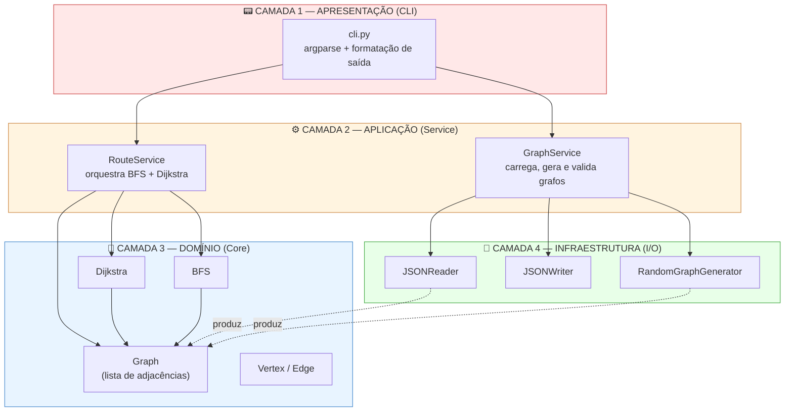

# E2 — Design Técnico, Arquitetura e Backlog

> **Disciplina:** Teoria dos Grafos
> **Prazo:** 13 de abril de 2026
> **Peso:** 20% da nota final

---

## Identificação do Grupo

| Campo | Preenchimento |
|-------|---------------|
| Nome do projeto | **FoodNode Analytics** — Sistema de Roteamento Ótimo para Entregas de Fast-Food |
| Repositório GitHub | `[https://github.com/LuishPalacio/foodnode-analytics]`
| Integrante 1 | Luís Henrique Palacio — RGM: 37620932 |
| Integrante 2 | Eduardo Pereira — RGM: 38270102 |
| Integrante 3 | Gabriel Alves — RGM: 38561310 |

---

## 1. Algoritmos Escolhidos

### 1.1 Algoritmo Principal

| Campo | Resposta |
|-------|----------|
| Nome do algoritmo | Algoritmo de Dijkstra |
| Categoria | Guloso (greedy) — com relaxamento de arestas via fila de prioridade |
| Complexidade de tempo | O((V + E) log V) — implementação com min-heap binário |
| Complexidade de espaço | O(V + E) — lista de adjacências + vetores de distância e predecessor |
| Problema que resolve | *Single-source shortest path* (caminho mínimo a partir de uma origem) em grafo dirigido ponderado com pesos não-negativos |

**Por que este algoritmo foi escolhido?**

A escolha do Dijkstra decorre diretamente da modelagem definida no E1: a malha viária do bairro atendido pelo restaurante é um grafo **dirigido** (mão única, conversões proibidas) e **ponderado** com pesos **estritamente não-negativos** (a distância em metros entre dois cruzamentos é sempre ≥ 0). Esta combinação corresponde exatamente ao domínio de aplicabilidade do Dijkstra, que é matematicamente ótimo nessa classe de grafos.

Três fatores reforçam a escolha no contexto específico do sistema:

1. **Compatibilidade com a natureza esparsa da malha viária.** Em grafos urbanos típicos, E ≈ 2V a 4V (cada cruzamento conecta em média a 2–4 outros). Com lista de adjacências e min-heap binário, o Dijkstra executa em O((V+E) log V), o que mantém o sistema responsivo mesmo para grafos de centenas de cruzamentos — requisito declarado no E1.
2. **Determinismo e previsibilidade.** A garantia de otimalidade é fundamental para o domínio: uma rota "quase ótima" entregue com 2 minutos de atraso representa prejuízo real de negócio. Algoritmos gulosos puros (sem relaxamento) não garantem o caminho mínimo global.
3. **Simplicidade de implementação e manutenção.** O Dijkstra pode ser implementado em ~40 linhas de Python com `heapq`, sem dependências externas, o que cabe no prazo da disciplina e permite validação por testes unitários.

**Alternativa descartada e motivo:**

| Algoritmo alternativo | Motivo da exclusão |
|----------------------|-------------------|
| A* (A-star) | A* é teoricamente mais rápido que Dijkstra em domínios geográficos por usar uma heurística admissível (tipicamente distância euclidiana até o destino). No entanto, seu uso pressupõe que cada vértice armazene coordenadas (latitude/longitude) e exige implementação de função heurística adicional, aumentando a superfície de bugs. Para o porte previsto do grafo (até 500 vértices), o ganho de desempenho do A* sobre Dijkstra é marginal (< 50 ms na média), e não compensa o custo de implementação dentro do prazo da disciplina. A* fica registrado como evolução futura se o sistema escalar para grafos metropolitanos (10.000+ vértices). |

Adicionalmente, **Bellman-Ford** foi considerado e descartado porque sua única vantagem sobre Dijkstra é suportar pesos negativos — cenário inexistente no domínio (distância física nunca é negativa). Sua complexidade O(V·E) é estritamente pior.

**Limitações no contexto do problema:**

- **Pesos estáticos.** O Dijkstra assume que os pesos das arestas não mudam durante a execução. O sistema, portanto, não suporta atualização dinâmica de pesos para refletir bloqueios, acidentes ou congestionamento em tempo real — cenário explicitamente colocado em **Out-of-Scope** (seção 5.2). Em uma eventual evolução, o algoritmo indicado seria o **D\* Lite** (KOENIG; LIKHACHEV, 2005).
- **Origem única por execução.** Cada chamada calcula o caminho mínimo a partir de um único vértice de origem. Para consultas *all-pairs*, seria necessário executar Dijkstra N vezes ou usar Floyd-Warshall (O(V³)) — não previsto no escopo.

**Referência bibliográfica:**

> CORMEN, T. H.; LEISERSON, C. E.; RIVEST, R. L.; STEIN, C. **Algoritmos: teoria e prática**. Tradução da 3ª edição. Rio de Janeiro: Elsevier, 2012. Capítulo 24, seção 24.3: "Algoritmo de Dijkstra".
>
> DIJKSTRA, E. W. A note on two problems in connexion with graphs. **Numerische Mathematik**, v. 1, n. 1, p. 269–271, 1959. 

---

### 1.2 Algoritmo Adicional

| Campo | Resposta |
|-------|----------|
| Nome do algoritmo | BFS — Busca em Largura (*Breadth-First Search*) |
| Categoria | Busca não-informada / travessia de grafo |
| Complexidade de tempo | O(V + E) |
| Complexidade de espaço | O(V) — fila FIFO + vetor de visitados |

**Justificativa:**

O BFS é executado como **etapa de pré-verificação antes do Dijkstra**, com dois objetivos técnicos diretamente ligados ao domínio:

1. **Detectar alcançabilidade do destino.** Malhas viárias reais frequentemente contêm componentes fortemente conectados disjuntos — por exemplo, uma rua sem saída a partir da origem, ou uma região isolada pelo sentido de mão única de outras vias. Sem a verificação, o Dijkstra simplesmente retorna distância infinita, sem explicação clara para o usuário. Com BFS prévio, o sistema pode responder de forma explícita *"o endereço do cliente não é alcançável a partir do restaurante no grafo atual"*, evitando ambiguidade operacional.
2. **Listar vértices atingíveis para diagnóstico.** O BFS produz gratuitamente o conjunto de vértices alcançáveis a partir da origem, útil para o gerente de operação validar visualmente a cobertura do grafo carregado.

O custo adicional é desprezível: BFS é linear em V+E, enquanto Dijkstra é O((V+E) log V). Adicionar BFS não altera a classe de complexidade do sistema, mas agrega robustez.

**Relação com a especificação de tipo de grafo (E1):** o BFS também responde à pergunta *"o grafo é conectado?"* — no sentido fraco (ignorando direção) e forte (respeitando direção). O grafo do domínio é, em geral, **fracamente conectado mas não fortemente conectado**, dada a prevalência de mão única em malhas urbanas. O sistema tratará essa realidade explicitamente.

**Referência bibliográfica:**

> CORMEN, T. H.; LEISERSON, C. E.; RIVEST, R. L.; STEIN, C. **Algoritmos: teoria e prática**. Tradução da 3ª edição. Rio de Janeiro: Elsevier, 2012. Capítulo 22, seção 22.2: "Busca em largura".

---

## 2. Arquitetura em Camadas

O sistema adota arquitetura em 4 camadas com dependências unidirecionais (camadas superiores conhecem inferiores; o inverso nunca acontece). A separação é estrita: a camada de Domínio não importa nenhuma biblioteca de I/O, e a camada de Apresentação não conhece detalhes das estruturas de grafo.

### Diagrama de arquitetura



> **Nota:** O diagrama acima renderiza nativamente no GitHub via Mermaid. Uma versão exportada em PNG está disponível em `./docs/arquitetura_e2.png` como backup para visualizadores que não suportem Mermaid.

### Descrição das camadas

| Camada | Responsabilidade | Artefatos principais |
|--------|------------------|----------------------|
| **Apresentação (CLI)** | Interface com o usuário via linha de comando. Faz o *parsing* dos argumentos (`argparse`), valida formato de entrada do usuário (não do grafo) e formata a saída em texto legível. Não contém lógica de negócio nem conhece estruturas de grafo diretamente. | `src/presentation/cli.py` |
| **Aplicação (Service)** | Orquestra os casos de uso do sistema. `RouteService` coordena a execução (chama BFS para alcançabilidade e, se positivo, aciona Dijkstra). `GraphService` centraliza operações de ciclo de vida do grafo: carregar de JSON, gerar aleatoriamente, validar invariantes (pesos ≥ 0, ids únicos). | `src/application/route_service.py`, `src/application/graph_service.py` |
| **Domínio (Core)** | Contém as estruturas de dados do grafo (lista de adjacências) e os algoritmos puros (Dijkstra, BFS). Código desta camada é **100% livre de I/O** — não lê arquivos, não imprime, não faz logging. Isso garante que os algoritmos sejam testáveis isoladamente e reutilizáveis. | `src/domain/graph.py`, `src/domain/vertex.py`, `src/domain/edge.py`, `src/domain/algorithms/dijkstra.py`, `src/domain/algorithms/bfs.py` |
| **Infraestrutura (I/O)** | Adaptadores para fontes externas: leitura e escrita de arquivos JSON, geração aleatória de grafos (com seed para reprodutibilidade). É a única camada autorizada a tocar o sistema de arquivos. | `src/infrastructure/json_reader.py`, `src/infrastructure/json_writer.py`, `src/infrastructure/random_graph_generator.py` |

---

## 3. Estrutura de Diretórios

```
foodnode/
├── docs/
│   ├── README.md
│   ├── E1_FoodNodeAnalytics_Documento_de_Visão.md
│   ├── E2_FoodNodeAnalytics_Designer_técnico.md
│   ├── arquitetura_e2.png            # backup do diagrama Mermaid
│   └── conceitual_dominio.png        # diagrama conceitual refeito (bairro + restaurante + clientes)
│
├── src/
│   ├── presentation/                 # CAMADA 1 — Apresentação
│   │   ├── __init__.py
│   │   └── cli.py
│   │
│   ├── application/                  # CAMADA 2 — Aplicação (Service)
│   │   ├── __init__.py
│   │   ├── route_service.py
│   │   └── graph_service.py
│   │
│   ├── domain/                       # CAMADA 3 — Domínio (Core)
│   │   ├── __init__.py
│   │   ├── graph.py
│   │   ├── vertex.py
│   │   ├── edge.py
│   │   └── algorithms/
│   │       ├── __init__.py
│   │       ├── dijkstra.py
│   │       └── bfs.py
│   │
│   ├── infrastructure/               # CAMADA 4 — Infraestrutura (I/O)
│   │   ├── __init__.py
│   │   ├── json_reader.py
│   │   ├── json_writer.py
│   │   └── random_graph_generator.py
│   │
│   └── main.py                       # entry point
│
├── tests/
│   ├── test_graph.py
│   ├── test_dijkstra.py
│   ├── test_bfs.py
│   ├── test_json_io.py
│   └── test_route_service.py
│
├── data/
│   ├── sample_bairro_10v.json        # grafo didático para demonstração
│   ├── sample_bairro_50v.json        # grafo de teste principal
│   └── stress_test_500v.json         # grafo gerado para teste de desempenho
│
├── .gitignore
├── README.md
└── requirements.txt
```

> **Justificativa de desvios em relação ao template sugerido:**
>
> O template base propõe `src/{core, algorithms, io}`, estrutura de 3 camadas que **não separa apresentação de aplicação** e mistura algoritmos com dados em `core`. Para cumprir a exigência explícita de **4 camadas** (Apresentação, Aplicação, Domínio, Infraestrutura) do enunciado do E2, a estrutura foi reorganizada em `src/{presentation, application, domain, infrastructure}`, com cada pasta correspondendo literalmente a uma camada do diagrama. Os algoritmos (Dijkstra, BFS) foram colocados em `src/domain/algorithms/` porque são parte do núcleo de domínio do problema (teoria dos grafos), não de infraestrutura.
>
> Os arquivos dos documentos E1 e E2 foram colocados em `docs/` conforme exige o enunciado ("A pasta /doc deve conter o E1_template.md e o E2_template.md").

---

## 4. Definição do Dataset

**Formato de entrada aceito:** JSON.

Decisão tomada entre os três formatos sugeridos no enunciado (JSON, CSV, GraphML):

- **JSON escolhido** por ser legível, amplamente suportado em Python (biblioteca `json` da stdlib, sem dependências) e expressivo o suficiente para capturar metadados do grafo (nome do bairro, se é dirigido, faixa de pesos) junto aos dados.
- **CSV descartado:** não comporta metadados naturalmente e exige dois arquivos (vértices e arestas) ou convenções frágeis.
- **GraphML descartado:** formato XML é verboso e requer parser dedicado (`lxml` ou `networkx`), o que adiciona dependência externa sem ganho funcional no porte do projeto. Fica como formato de importação futura caso o sistema passe a consumir exportações diretas do OSMnx.

**Exemplo de estrutura do arquivo de entrada:**

```json
{
  "metadata": {
    "name": "Bairro Centro - recorte de 6 quadras",
    "vertices_count": 8,
    "edges_count": 12,
    "directed": true,
    "weighted": true,
    "weight_unit": "meters"
  },
  "vertices": [
    { "id": 0, "label": "Restaurante (origem)",         "type": "origin" },
    { "id": 1, "label": "Rua A x Rua 1",                "type": "intersection" },
    { "id": 2, "label": "Rua A x Rua 2",                "type": "intersection" },
    { "id": 3, "label": "Rua B x Rua 1",                "type": "intersection" },
    { "id": 4, "label": "Rua B x Rua 2",                "type": "intersection" },
    { "id": 5, "label": "Rua C x Rua 1",                "type": "intersection" },
    { "id": 6, "label": "Cliente João (destino)",       "type": "destination" },
    { "id": 7, "label": "Cliente Maria (destino)",      "type": "destination" }
  ],
  "edges": [
    { "origem": 0, "destino": 1, "peso": 120 },
    { "origem": 0, "destino": 3, "peso": 85 },
    { "origem": 1, "destino": 2, "peso": 95 },
    { "origem": 3, "destino": 4, "peso": 100 },
    { "origem": 2, "destino": 6, "peso": 140 },
    { "origem": 4, "destino": 5, "peso": 110 },
    { "origem": 5, "destino": 7, "peso": 90 }
  ]
}
```

**Invariantes validadas na carga (GraphService):**

- Todo `id` de vértice aparece exatamente uma vez em `vertices`.
- Toda aresta referencia `origem` e `destino` existentes em `vertices`.
- Todo `peso` é numérico e ≥ 0 (rejeição imediata caso contrário — reflete a premissa do Dijkstra).
- Existe no mínimo um vértice com `type: "origin"`.

**Estratégia de geração aleatória:**

| Parâmetro | Descrição | Default |
|-----------|-----------|---------|
| `--vertices N` | Número de vértices do grafo gerado (inteiro ≥ 2) | 50 |
| `--density d` | Probabilidade de existir aresta dirigida entre par ordenado (u,v). Valores típicos para malhas viárias: 0.05 a 0.20 (grafos esparsos) | 0.15 |
| `--weight-min` / `--weight-max` | Faixa inclusiva para sorteio uniforme dos pesos, em metros | 30 / 2000 |
| `--seed` | Semente do gerador pseudoaleatório para reprodutibilidade | aleatória (timestamp) |
| `--force-connected` | Se `true`, garante conectividade fraca gerando primeiro uma árvore geradora e depois adicionando arestas até a densidade alvo | `false` |

O gerador usa `random.Random(seed)` isolado para não interferir com outros usos de aleatoriedade no sistema, e exporta no mesmo schema JSON documentado acima, permitindo que grafos gerados sejam posteriormente lidos pelo mesmo `JSONReader`.

---

## 5. Backlog do Projeto

### 5.1 In-Scope — O que será implementado

| # | Funcionalidade | Prioridade | Critério de aceite |
|---|----------------|------------|--------------------|
| 1 | Carga de grafo a partir de arquivo JSON (`JSONReader`) | Alta | **Dado** um arquivo JSON válido contendo 50 vértices e 120 arestas no schema documentado, **quando** o usuário executar `foodnode load --file data/sample_bairro_50v.json`, **então** o sistema carrega o grafo em memória em menos de 500 ms, valida todas as invariantes (ids únicos, pesos ≥ 0, referências válidas) e exibe no console: `Grafo carregado: 50 vértices, 120 arestas, dirigido=true`. |
| 2 | Cálculo do caminho mínimo com Dijkstra | Alta | **Dado** um grafo carregado com 50 vértices e um par de vértices (origem=0, destino=37) alcançáveis, **quando** o usuário executar `foodnode route --origin 0 --destination 37`, **então** o sistema retorna (a) a sequência ordenada de vértices `[0, 5, 12, 23, 37]`, (b) o custo total em metros e (c) o tempo de execução do Dijkstra, tudo em tempo inferior a 1 segundo. |
| 3 | Verificação prévia de alcançabilidade com BFS | Alta | **Dado** um grafo em que o vértice de destino 99 não é alcançável a partir da origem 0 (componente disjunto), **quando** o usuário executar `foodnode route --origin 0 --destination 99`, **então** o sistema detecta a inalcançabilidade via BFS antes de invocar o Dijkstra e retorna a mensagem explícita `Destino 99 não é alcançável a partir da origem 0 no grafo atual.`, encerrando com código de saída 0 (não é erro, é resposta válida). |
| 4 | Geração de grafo aleatório parametrizável | Alta | **Dado** os parâmetros `--vertices 100 --density 0.15 --weight-min 50 --weight-max 2000 --seed 42`, **quando** o usuário executar `foodnode generate --output data/gerado.json`, **então** o sistema produz um arquivo JSON no schema documentado contendo exatamente 100 vértices, aproximadamente 1485 arestas (100 × 99 × 0.15), todos os pesos no intervalo [50, 2000], e a re-execução com a mesma seed produz arquivo byte-a-byte idêntico. |
| 5 | Interface CLI com subcomandos (`load`, `route`, `generate`, `info`) | Alta | **Dado** que o usuário digita `foodnode --help` no terminal, **quando** o comando é executado, **então** o sistema exibe a lista de subcomandos disponíveis com descrição de cada um em menos de 200 ms e encerra com código 0; e **dado** um subcomando inválido, **quando** executado, **então** o sistema exibe mensagem de erro legível e encerra com código não-zero. |
| 6 | Exportação da rota calculada em JSON | Média | **Dado** uma rota já calculada pelo Dijkstra com 5 vértices e custo 430 metros, **quando** o usuário passar a flag `--export data/rota.json`, **então** o sistema escreve um arquivo JSON contendo `{ "origem": 0, "destino": 37, "caminho": [0, 5, 12, 23, 37], "custo_total_metros": 430, "algoritmo": "dijkstra", "tempo_ms": 12.4 }` que é posteriormente legível por qualquer parser JSON padrão. |

### 5.2 Out-of-Scope — O que NÃO será feito

| Funcionalidade excluída | Motivo |
|--------------------------|--------|
| Atualização dinâmica de pesos em tempo de execução (bloqueios, acidentes, congestionamento em tempo real) | Exigiria substituir Dijkstra por D\* Lite (KOENIG; LIKHACHEV, 2005), com complexidade de implementação significativamente maior. O E1 mencionou bloqueios apenas como motivação do domínio; para o protótipo da disciplina, os pesos são **estáticos por execução**. Fica como roadmap explícito para v2. |
| Interface gráfica web ou mobile (visualização interativa do grafo e da rota em mapa real) | O foco do projeto é demonstrar a correção e a eficiência dos algoritmos de grafo. Uma UI gráfica consumiria desproporcionalmente o tempo da equipe sem adicionar valor à avaliação de Teoria dos Grafos. A saída textual/JSON via CLI é suficiente para validação. |
| Integração em tempo de execução com APIs externas de mapas (Google Maps, OpenStreetMap/Overpass, Waze) | Requer credenciais, tratamento de rate-limits, cache e disponibilidade de rede, além de levantar questões de custo. O sistema opera exclusivamente sobre arquivos JSON locais, o que o torna autocontido e testável offline. |
| Roteamento com múltiplos entregadores e múltiplas entregas simultâneas (*Vehicle Routing Problem* — VRP) | Problema NP-difícil, cuja solução exata é inviável para grafos de tamanho médio e cuja heurística (ex.: Clarke-Wright, Tabu Search) representaria um projeto independente. O sistema atual resolve o problema do caminho mínimo ponto-a-ponto (1 origem, 1 destino), que é a base sobre a qual VRP seria posteriormente construído. |
| Consideração de janelas de tempo de entrega, prioridades de pedido e preferências do cliente | São restrições de otimização combinatória de nível superior (*Time-Constrained Routing*), fora do escopo de um projeto de fundamentos de grafos. Adicionariam variáveis de decisão não-topológicas que não se modelam naturalmente como pesos de aresta. |

---

## Checklist de Entrega

- [x] Big-O de tempo e espaço declarados para cada algoritmo *(Dijkstra: O((V+E) log V) tempo, O(V+E) espaço; BFS: O(V+E) tempo, O(V) espaço — seções 1.1 e 1.2)*
- [x] Ao menos 1 alternativa descartada com justificativa *(A\* na tabela da seção 1.1; Bellman-Ford mencionado no texto)*
- [x] Diagrama de arquitetura com 4 camadas identificadas *(seção 2, diagrama Mermaid com Apresentação / Aplicação / Domínio / Infraestrutura nomeadas e coloridas)*
- [x] Referência bibliográfica para cada algoritmo (ABNT ou IEEE) *(CORMEN et al., 2012 + DIJKSTRA, 1959 para o principal; CORMEN et al., 2012 para o BFS — seções 1.1 e 1.2; formato ABNT)*
- [x] Backlog com ≥ 5 itens In-Scope e ≥ 3 Out-of-Scope *(6 In-Scope e 5 Out-of-Scope — seções 5.1 e 5.2)*
- [x] Ao menos 3 critérios de aceite no formato "dado / quando / então" *(todos os 6 itens In-Scope estão no formato)*
- [x] Exemplo de estrutura de arquivo de entrada presente *(seção 4, JSON completo com metadados, 8 vértices e 7 arestas)*

---

## Referências Bibliográficas Consolidadas

CORMEN, T. H.; LEISERSON, C. E.; RIVEST, R. L.; STEIN, C. **Algoritmos: teoria e prática**. Tradução da 3ª edição. Rio de Janeiro: Elsevier, 2012.

DIJKSTRA, E. W. A note on two problems in connexion with graphs. **Numerische Mathematik**, v. 1, n. 1, p. 269–271, 1959.

HART, P. E.; NILSSON, N. J.; RAPHAEL, B. A formal basis for the heuristic determination of minimum cost paths. **IEEE Transactions on Systems Science and Cybernetics**, v. 4, n. 2, p. 100–107, 1968. *(referência do A\*, usada como alternativa descartada)*

KOENIG, S.; LIKHACHEV, M. Fast replanning for navigation in unknown terrain. **IEEE Transactions on Robotics**, v. 21, n. 3, p. 354–363, 2005. *(referência do D\* Lite, mencionado como evolução futura)*

---

*Teoria dos Grafos — Profa. Dra. Andréa Ono Sakai*
