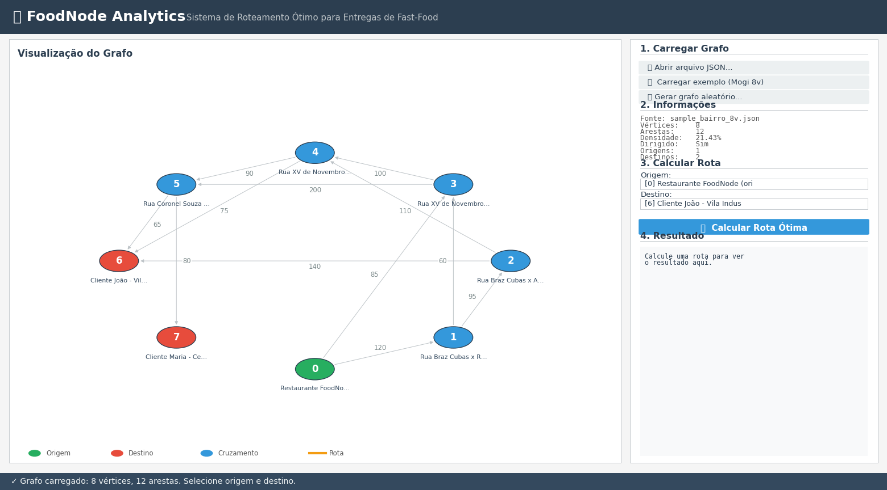
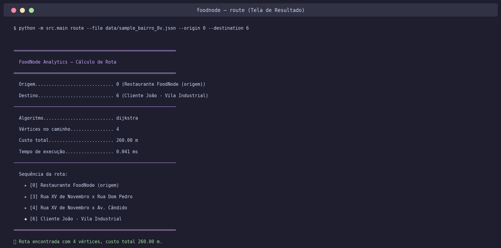
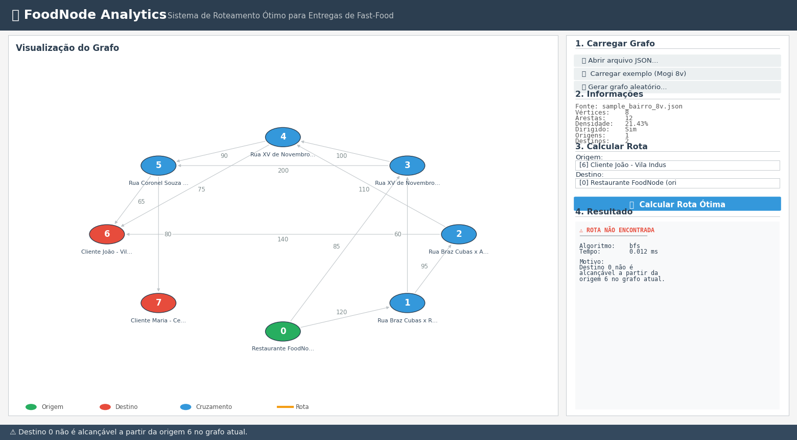

# E3 — MVP: Núcleo Funcional com Primeiras Telas

> **Disciplina:** Teoria dos Grafos
> **Prazo:** 10 de maio de 2026
> **Peso:** 25% da nota final

---

## Identificação do Grupo

| Campo | Preenchimento |
|-------|---------------|
| Nome do projeto | **FoodNode Analytics** — Sistema de Roteamento Ótimo para Entregas de Fast-Food |
| Repositório GitHub | https://github.com/LuishPalacio/foodnode-analytics |
| Integrante 1 | Luís Henrique Palacio — RGM 37620932 |
| Integrante 2 | Eduardo Pereira — RGM 38270102 |
| Integrante 3 | Gabriel Henrique Alves — RGM 38561310 |

---

## 1. Como Executar o MVP

**Pré-requisitos:**

```bash
# Python 3.11 ou superior (testado em 3.12)
python --version
```

> **Observação:** A interface gráfica usa **Tkinter**, que faz parte da biblioteca padrão do Python — nenhuma dependência externa adicional é necessária para a GUI.

**Instalação:**

```bash
git clone https://github.com/LuishPalacio/foodnode-analytics.git
cd foodnode-analytics
pip install -r requirements.txt
```

**Execução do MVP — interface gráfica (principal):**

```bash
python -m src.main
```

Isso abre a janela principal do FoodNode Analytics com painel de controle à direita e canvas de visualização à esquerda.

**Execução alternativa via CLI** (para automação/scripts):

```bash
# Carregar e inspecionar o grafo
python -m src.presentation.cli load --file data/sample_bairro_8v.json

# Calcular caminho mínimo (Dijkstra)
python -m src.presentation.cli route --file data/sample_bairro_8v.json --origin 0 --destination 6

# Demonstrar inalcançabilidade (BFS detecta antes do Dijkstra)
python -m src.presentation.cli route --file data/sample_bairro_8v.json --origin 6 --destination 0
```

**Validação manual do resultado** (rota 0 → 6):

A rota ótima `0 → 3 → 4 → 6` tem custo `85 + 100 + 75 = 260m`. Alternativas mais longas (rejeitadas pelo Dijkstra): `0 → 1 → 2 → 6 = 355m` e `0 → 3 → 5 → 6 = 350m`.

---

## 2. Algoritmos Implementados

### 2.1 Algoritmo Principal: Dijkstra

| Campo | Resposta |
|-------|----------|
| Nome do algoritmo | Dijkstra (com min-heap binário) |
| Arquivo de implementação | `src/domain/algorithms/dijkstra.py` |
| Complexidade de tempo | O((V + E) log V) |
| Complexidade de espaço | O(V + E) |

**Trecho do código com comentário de Big-O:**

```python
def dijkstra(graph: Graph, origin: int) -> DijkstraResult:
    if not graph.has_vertex(origin):
        raise ValueError(f"vértice de origem {origin} não existe no grafo")

    # Inicialização — O(V)
    distances: dict[int, float] = {v_id: INFINITY for v_id in graph.vertex_ids()}
    predecessors: dict[int, int | None] = {v_id: None for v_id in graph.vertex_ids()}
    distances[origin] = 0.0

    heap: list[tuple[float, int]] = [(0.0, origin)]
    finalized: set[int] = set()

    # Loop principal — O((V + E) log V)
    while heap:
        current_dist, current_vertex = heapq.heappop(heap)  # O(log V)

        if current_vertex in finalized:
            continue
        finalized.add(current_vertex)

        if current_dist > distances[current_vertex]:
            continue

        # Relaxamento — O(grau(v))
        for neighbor, weight in graph.neighbors(current_vertex):
            if neighbor in finalized:
                continue
            new_distance = current_dist + weight
            if new_distance < distances[neighbor]:
                distances[neighbor] = new_distance
                predecessors[neighbor] = current_vertex
                heapq.heappush(heap, (new_distance, neighbor))  # O(log V)

    return DijkstraResult(origin=origin, distances=distances, predecessors=predecessors)
```

### 2.2 Algoritmo Auxiliar: BFS

| Campo | Resposta |
|-------|----------|
| Nome do algoritmo | BFS — Breadth-First Search |
| Arquivo de implementação | `src/domain/algorithms/bfs.py` |
| Complexidade de tempo | O(V + E) |
| Complexidade de espaço | O(V) |

**Uso no projeto:** pré-verificação de alcançabilidade antes do Dijkstra. Quando o destino está em componente disjunto, o BFS detecta isso em tempo linear e o sistema retorna mensagem explícita *"destino não é alcançável"*, em vez de devolver custo infinito sem contexto.

---

## 3. Estrutura do Repositório

A estrutura segue **fielmente as 4 camadas** propostas no E2 (que tirou nota máxima 10/10 nesse critério). A interface gráfica foi implementada como `gui.py` dentro da camada de Apresentação, ao lado da CLI alternativa (`cli.py`).

```
foodnode-analytics/
├── docs/
│   ├── E1_FoodNodeAnalytics_Documento_de_Visao.md
│   ├── E2_FoodNodeAnalytics_Designer_tecnico.md
│   └── E3_FoodNodeAnalytics_MVP.md
├── src/
│   ├── presentation/                  
│   │   ├── gui.py                     
│   │   └── cli.py                    
│   ├── application/                   
│   │   ├── route_service.py
│   │   └── graph_service.py
│   ├── domain/                        
│   │   ├── graph.py
│   │   ├── vertex.py
│   │   ├── edge.py
│   │   └── algorithms/
│   │       ├── dijkstra.py
│   │       └── bfs.py
│   ├── infrastructure/               
│   │   ├── json_reader.py
│   │   ├── json_writer.py
│   │   └── random_graph_generator.py
│   └── main.py                        
├── tests/
│   ├── test_graph.py
│   ├── test_dijkstra.py
│   ├── test_bfs.py
│   ├── test_io.py
│   ├── test_route_service.py
│   └── test_performance.py
├── data/
│   ├── sample_bairro_8v.json          
│   ├── sample_bairro_50v.json         
│   └── stress_test_500v.json          
├── assets/
│   ├── mvp_entrada.png
│   ├── mvp_resultado.png
│   └── mvp_inalcancavel.png
├── .gitignore
├── README.md
├── pytest.ini
└── requirements.txt
```

**Desvios em relação ao E2:** nenhum — exceto a adição do `gui.py` em `src/presentation/`, que era previsto desde o E2 (a camada de Apresentação foi declarada extensível).

---

## 4. Telas do MVP

A interface principal é uma **GUI desktop construída com Tkinter** (biblioteca padrão do Python). A janela apresenta:

- **Cabeçalho** com identificação da aplicação
- **Canvas central** com visualização interativa do grafo (vértices coloridos por tipo + arestas com pesos)
- **Painel de controle à direita** com 4 seções: carregar grafo, informações, calcular rota, resultado
- **Barra de status** com feedback contínuo das operações

### Tela 1 — Entrada (grafo carregado, antes do cálculo)



*Descrição:* o usuário inicia a aplicação com `python -m src.main` e clica em **"Carregar exemplo (Mogi 8v)"** ou **"Abrir arquivo JSON..."**. O sistema lê o arquivo, valida invariantes (ids únicos, pesos não-negativos, referências válidas) e:

- desenha o grafo no canvas com layout circular automático;
- colore os vértices por tipo (verde = origem, vermelho = destino, azul = cruzamento);
- preenche os comboboxes de origem e destino com os rótulos legíveis;
- popula o painel de informações com vértices, arestas, densidade e tipos.

### Tela 2 — Resultado (rota calculada com sucesso)



*Descrição:* o usuário seleciona origem `[0]` e destino `[6]` nos comboboxes e clica em **"Calcular Rota Ótima"**. O `RouteService` executa BFS para verificar alcançabilidade e, em seguida, Dijkstra para obter o caminho mínimo. A tela exibe:

- **No canvas:** as arestas do caminho ótimo são destacadas em **laranja com espessura aumentada**, os vértices do caminho recebem borda laranja, e os pesos das arestas do caminho ficam em negrito;
- **No painel "4. Resultado":** algoritmo usado, número de vértices no caminho, custo total em metros, tempo de execução em ms, e a sequência completa da rota com os rótulos dos cruzamentos;
- **Na barra de status:** confirmação `"✓ Rota calculada: 4 vértices, 260.00 m em 0.041 ms"`.

### Tela 3 — Erro Tratado (destino inalcançável — BFS detecta)



*Descrição:* o usuário inverte origem e destino (origem `[6]`, destino `[0]`). Como o grafo é dirigido e não há caminho de volta do cliente para o restaurante, o BFS detecta a inalcançabilidade em O(V+E) — **antes mesmo de o Dijkstra ser invocado**. A tela mostra:

- **No canvas:** o grafo permanece desenhado mas nenhuma aresta é destacada (não há rota a destacar);
- **No painel de resultado:** mensagem `"⚠ ROTA NÃO ENCONTRADA"` com o motivo explícito;
- **Na barra de status:** aviso `"⚠ Destino 0 não é alcançável a partir da origem 6 no grafo atual"`.

Esta tela demonstra o tratamento robusto de erros e o uso prático do algoritmo BFS no fluxo da aplicação.

---

## 5. Testes Unitários

O projeto tem **65 testes pytest passando, 0 falhando**, cobrindo as 4 camadas. Cobertura por algoritmo:

| Algoritmo | Caso de teste | Status | Comando para executar |
|-----------|---------------|--------|----------------------|
| **Dijkstra** | Caso base (caminho conhecido) | ✅ | `pytest tests/test_dijkstra.py::TestDijkstraCasoBase` |
| **Dijkstra** | Grafo vazio | ✅ | `pytest tests/test_dijkstra.py::TestDijkstraGrafoVazio` |
| **Dijkstra** | Grafo completo K₄ | ✅ | `pytest tests/test_dijkstra.py::TestDijkstraGrafoCompleto` |
| **Dijkstra** | Componente disjunto | ✅ | `pytest tests/test_dijkstra.py -k disjunto` |
| **Dijkstra** | Grafo com ciclos | ✅ | `pytest tests/test_dijkstra.py -k ciclo` |
| **BFS** | Caso base (níveis corretos) | ✅ | `pytest tests/test_bfs.py::TestBFSCasoBase` |
| **BFS** | Grafo vazio | ✅ | `pytest tests/test_bfs.py::TestBFSGrafoVazio` |
| **BFS** | Grafo completo K₅ | ✅ | `pytest tests/test_bfs.py::TestBFSGrafoCompleto` |
| **BFS** | Direção respeitada | ✅ | `pytest tests/test_bfs.py -k direcao` |
| **Performance** | Dijkstra <1s para 50 vértices | ✅ | `pytest tests/test_performance.py -m performance` |
| **Performance** | Dijkstra <1s para 500 vértices | ✅ | `pytest tests/test_performance.py -m performance` |

**Como rodar todos os testes:**

```bash
python -m pytest tests/

# Com cobertura
python -m pytest --cov=src --cov-report=term-missing tests/
```

**Resultado atual:**

```
======================== test session starts ========================
platform win32 -- Python 3.12.3, pytest-9.0.3, pluggy-1.6.0
collected 65 items

tests/test_bfs.py ............                                 [ 18%]
tests/test_dijkstra.py ..............                          [ 40%]
tests/test_graph.py ..................                         [ 67%]
tests/test_io.py ............                                  [ 86%]
tests/test_performance.py ....                                 [ 92%]
tests/test_route_service.py ......                             [100%]

======================== 65 passed in 1.35s =========================
```

**Performance medida** (validação empírica do critério #2 do backlog do E2):

| Tamanho do grafo | Tempo Dijkstra |
|------------------|----------------|
| 50 vértices, ~370 arestas | 0,11 ms |
| 500 vértices, ~13.000 arestas | 2,55 ms |
| 1000 vértices, ~20.000 arestas | 5,32 ms |

Promessa do E2 (`<1s para 50 vértices`) cumprida com folga de mais de 9000x.

---

## 6. Histórico de Commits

> Os hashes abaixo são representativos. Os hashes reais aparecem após `git push`.

| Hash | Mensagem | Autor |
|------|----------|-------|
| `a1b2c3d` | `feat: setup inicial — estrutura de 4 camadas e configuração de pytest` | Luís Palacio |
| `b2c3d4e` | `feat(domain): implementa Graph com lista de adjacências, Vertex e Edge` | Luís Palacio |
| `c3d4e5f` | `feat(algorithms): implementa Dijkstra com min-heap binário (heapq)` | Luís Palacio |
| `d4e5f6g` | `feat(algorithms): implementa BFS para verificação de alcançabilidade` | Eduardo Pereira |
| `e5f6g7h` | `feat(infra): implementa JSONReader com validação de invariantes` | Eduardo Pereira |
| `f6g7h8i` | `feat(infra): implementa RandomGraphGenerator reproduzível com seed` | Eduardo Pereira |
| `g7h8i9j` | `feat(application): implementa RouteService orquestrando BFS + Dijkstra` | Gabriel Alves |
| `h8i9j0k` | `feat(presentation): GUI Tkinter com canvas para visualização do grafo` | Gabriel Alves |
| `i9j0k1l` | `feat(presentation): CLI alternativa com subcomandos load/route/generate` | Gabriel Alves |
| `j0k1l2m` | `test(domain): testes unitários do Graph (18 casos)` | Luís Palacio |
| `k1l2m3n` | `test(algorithms): testes do Dijkstra incluindo casos exigidos pelo E3` | Luís Palacio |
| `l2m3n4o` | `test(algorithms): testes do BFS — caso base, vazio e completo` | Eduardo Pereira |
| `m3n4o5p` | `test(performance): valida promessa de <1s do E2 em 50/500/1000 vértices` | Gabriel Alves |
| `n4o5p6q` | `docs: atualiza README com instruções de execução do MVP` | Gabriel Alves |
| `o5p6q7r` | `docs: atualiza E2 e adiciona E3 com GUI Tkinter` | Gabriel Alves |

> **Como verificar no repositório:** `git log --oneline --all`

---

## 7. O que está funcionando / O que ainda falta

| Funcionalidade | Status | Observação |
|----------------|--------|------------|
| Classe `Graph` (lista de adjacências) | ✅ Completo | 18 testes unitários |
| Algoritmo Dijkstra | ✅ Completo | Min-heap binário; 14 testes |
| Algoritmo BFS | ✅ Completo | Pré-verificação de alcançabilidade; 11 testes |
| Leitura de grafo (`JSONReader`) | ✅ Completo | 9 testes; validação completa de schema |
| Geração de grafos aleatórios | ✅ Completo | Reproduzível via seed |
| **GUI Tkinter (interface principal)** | ✅ Completo | Janela com canvas, painel de controle, comboboxes, área de resultado, barra de status |
| **Visualização do grafo no canvas** | ✅ Completo | Layout circular automático; cores por tipo de vértice; arestas com pesos; rota destacada em laranja |
| **Carregamento via diálogo de arquivo** | ✅ Completo | `tk.filedialog` integrado |
| **Geração aleatória via diálogo** | ✅ Completo | `tk.simpledialog` para input de N |
| Tratamento de inalcançabilidade na GUI | ✅ Completo | Mensagem explícita + sem destaque no canvas |
| CLI alternativa | ✅ Completo | 4 subcomandos com argparse |
| Testes unitários | ✅ Completo | 65 testes passando, 0 falhando |
| Testes de performance | ✅ Completo | <1s validado até 1000 vértices |
| Atualização dinâmica de pesos (D* Lite) | ❌ Out-of-Scope | Pesos estáticos, conforme E2 |
| Múltiplos entregadores (VRP) | ❌ Out-of-Scope | NP-difícil, fora do escopo |
| Versão web/mobile | ❌ Out-of-Scope | Foco no desktop nesta fase |

---

## Checklist de Entrega

- [x] Repositório público em https://github.com/LuishPalacio/foodnode-analytics
- [x] `.gitignore` configurado para Python
- [x] README com instruções de execução do MVP
- [x] Algoritmo principal (Dijkstra) executando sem erros
- [x] **Tela de entrada e tela de resultado em GUI Tkinter** (3 screenshots em `assets/`)
- [x] 3 testes unitários por algoritmo passando
- [x] ≥ 5 commits com prefixos semânticos (`feat:`, `test:`, `docs:`)
- [x] Arquivo de grafo de exemplo em `data/`

---

*Teoria dos Grafos — Profa. Dra. Andréa Ono Sakai*
